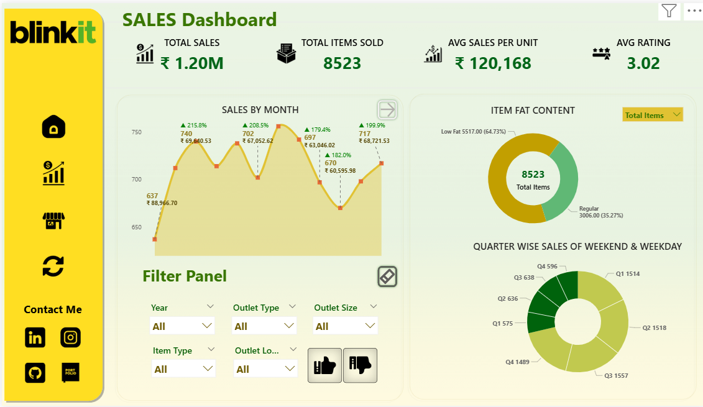
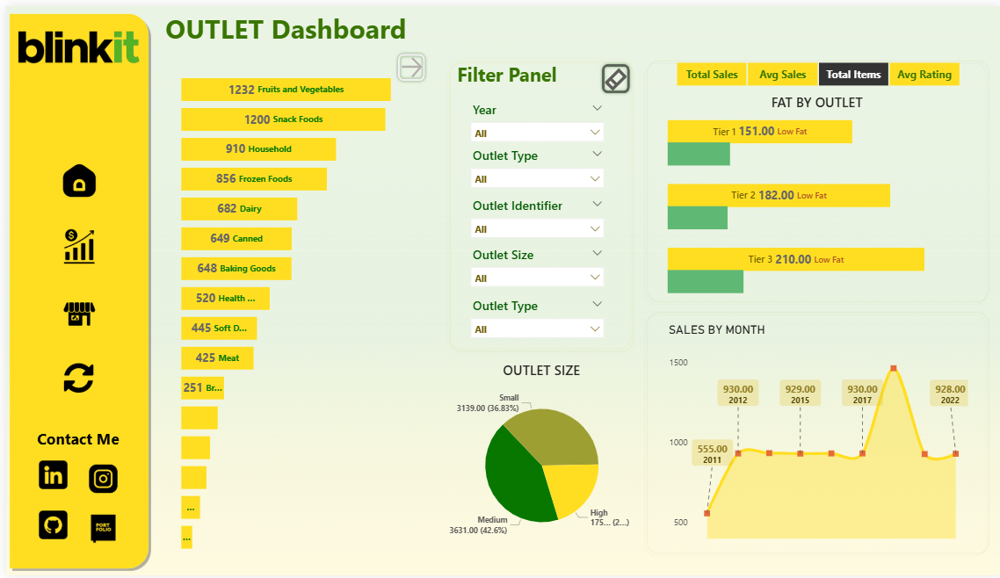
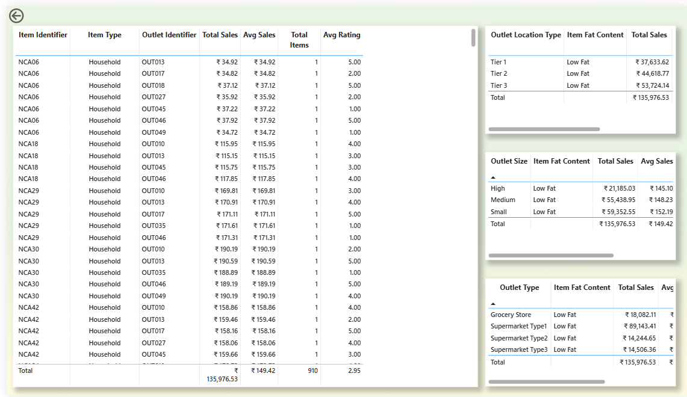
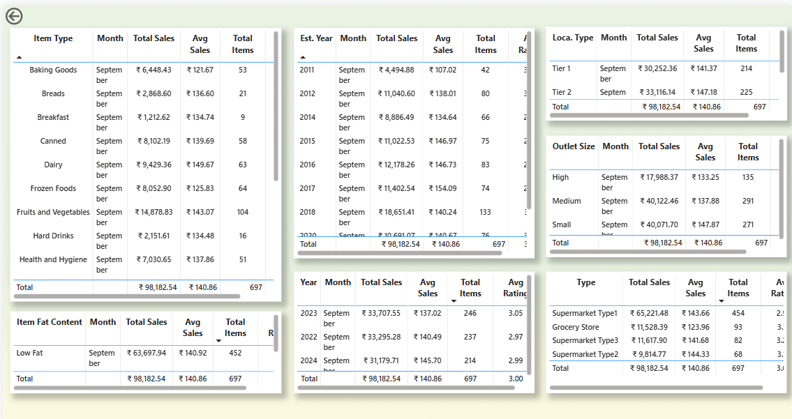

# 📊 Blinkit Sales Analysis Dashboard

## Project Overview

<p align='justify'>
This Power BI project examines sales, outlet, and item-level statistics of a retail chain based on the business model of Blinkit. The dashboard gives value-adding analytics into high-selling products, store activity, monthly patterns, and customer reviews through a tidy design, filters, and drillthroughs.
</p>

## 📁 Dataset Summary

- **File Name:** `Blinkit.csv`
- **Source:** Retail sales data
- **Rows:** 8,523
- **Columns:** 13
- **Cleaning Done:**  
  - Standardized inconsistent entries in `Item Fat Content`:
    - `'LF'`, `'low fat'` → `Low Fat`
    - `'reg'` → `Regular`
  - Null values checked; key focus on `Item Weight` missing data

## 📐 Data Modeling & Measures

### 📅 **Calendar Table**
Created using DAX to support time-based analysis:
```DAX
Calendar = 
ADDCOLUMNS (
    CALENDAR (MIN(Blinkit[Sales Date]), MAX(Blinkit[Sales Date])),
    "Year", YEAR([Date]),
    "MonthNumber", MONTH([Date]),
    "MonthName", FORMAT([Date], "MMMM"),
    "ShortMonth", FORMAT([Date], "MMM"),
    "Quarter", "Q" & FORMAT([Date], "Q"),
    "YearMonth", FORMAT([Date], "YYYY-MM"),
    "Weekday", WEEKDAY([Date]),
    "WeekdayName", FORMAT([Date], "dddd"),
    "IsWeekend", IF(WEEKDAY([Date],2)>5,"Weekend","Weekday")
)
```

### 🔢 Measures Created

| Measure                      | Description                                 |
|------------------------------|---------------------------------------------|
| `Avg Sales`, `Total Sales`   | Basic revenue KPIs                         |
| `Avg Sales per Outlet`       | Normalized outlet sales                    |
| `Total Items`, `Items Sold`  | Inventory insights                         |
| `Total Outlet`               | Retail presence metrics                    |
| `Sales Diff`, `MoM`, `MoM %` | Month-over-Month growth                    |
| `Outlet Sales Rank`          | Ranked store performance                   |
| `Item Rank Within Type`      | Ranking items within their category        |
| `MAX Rating`, `Avg Rating`   | Customer satisfaction indicators           |

These measures drive all the KPIs and trend visualizations.

## 📊 Dashboards Overview

### 1. 🔹 **Sales Dashboard**
Focus: Product performance, item attributes, and sales trends

**Includes:**
- KPIs: Total Sales, Items Sold, Avg Rating, Avg Sales
- Sales by Month (with MoM trends)
- Item Fat Content (Donut Chart)
- Quarter-wise item distribution
- Filters: Year, Outlet Type, Size, Item Type, Location

Show what the dashboard looks like. - 

### 2. 🔹 **Outlet Dashboard**
Focus: Outlet performance across types, sizes, and tiers

**Includes:**
- Most selling item types (Fruits, Snacks, Household)
- Outlet Size split (Medium, Small, High)
- Sales by Outlet Tier (1, 2, 3)
- Sales by Month and Outlet Type
- Filters: Year, Outlet Size, Type, Location

Show what the dashboard looks like. - 

## 🔁 Drillthrough Pages

### 3. 🔍 **Sales Details (Drillthrough)**
**Purpose:** Deep dive into sales by item, outlet, fat content, and size  
- Item-wise sales metrics (total, average)
- Outlet Location vs Size analysis
- Fat content performance
- Dynamic filters preserved

Show what the dashboard looks like. - 

### 4. 🔍 **Outlet Details (Drillthrough)**
**Purpose:** Analyze outlet-wise item and sales performance  
- Sales by Item Type
- Outlet Establishment Year breakdown
- Tier-based outlet analysis
- Sales by Outlet Size & Type
- Fat content variation by outlet

Show what the dashboard looks like. - 

## 📽️ Demo Video

🔗 [Watch demo video](https://drive.google.com/file/d/1jV3IluddHjfd2e9ss06X8JfiYEe0L_JI/view)

## 📈 Key Business Insights

- 📦 **Top Item Types**: Fruits & Vegetables, Snack Foods
- 🏪 **Best Performing Outlets**: Small & Medium size dominate sales
- 🥗 **Fat Content Demand**: Low Fat items make up 65% of sales
- 📅 **Sales Consistency**: Steady performance with peak months around mid-year
- ⭐ **Avg Ratings**: Vary across outlet type and item category (~2.99–3.08 avg)

## 🛠 Tools & Tech Used

- **Power BI Desktop** (2025)
- Power Query for data cleaning
- DAX for calculations and KPIs
- Interactive bookmarks, slicers, and drillthroughs

## 📎 Use Cases

- Evaluate outlet-wise sales contributions
- Compare product performance by category & fat content
- Enable business decisions with seasonal and regional insights
- Identify underperforming outlets or product categories

## 📌 Report Navigation

- `Home`  
- [`Sales Dashboard`](https://github.com/Shivs0147/Blinkit-Report-PBI/blob/main/Snapshot_of_Sales_Dashboard.png)
- [`Outlet Dashboard`](https://github.com/Shivs0147/Blinkit-Report-PBI/blob/main/Snapshot_of_Outlet_Dashboard.png) 
- [`Sales Drillthrough`](https://github.com/Shivs0147/Blinkit-Report-PBI/blob/main/Snapshot_of_Sales_Drillthrough.png)
- [`Outlet Drillthrough`](https://github.com/Shivs0147/Blinkit-Report-PBI/blob/main/Snapshot_of_Outlet_Drillthrough.png)

## ✨ Author Notes

<p align='justify'>
This Power BI dashboard was created to demonstrate the full cycle of data cleaning, modeling, DAX measures, and interactive visualization. It is ideal for data analyst portfolios and business reporting use cases.
</p>

## **👤 Author & Contact**

<ul>
  <li>Name - Shivam Gabani</li>
  <li>📧 Email: shivamgabani.744@outlook.com</li>
  <li>💼 LinkedIn: https://www.linkedin.com/in/shivam-gabani-38192a36b/</li>
  <li>📍 Surat, Gujarat.</li>
</ul>

## 🙌 Thanks for Scrolling!

If you liked this report, feel free to star ⭐ the repo or connect with me on LinkedIn.

I’m always open to feedback, learning, and new collaborations.

Cheers!  
**– Shivam Gabani**
